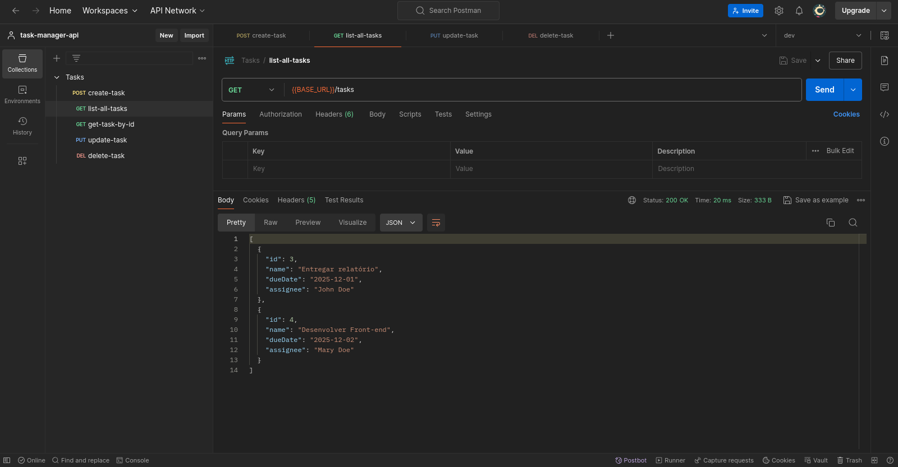

<h1 align="center">
  Task Manager API
</h1>

<p align="center">
  

  

  
  
  <a href="https://github.com/pabloxt14/task-manager-api/commits/master">
    
  </a>
    
   

   <a href="https://github.com/pabloxt14/task-manager-api/stargazers">
    
  </a>
</p>

<p>
  
</p>

<p align="center">
 <a href="#-about">About</a> | 
 <a href="#-endpoints">Endpoints</a> | 
 <a href="#-setup">Setup</a> | 
 <a href="#-technologies">Technologies</a> | 
 <a href="#-license">License</a>
</p>


## 💻 About

O **task-manager-api** consiste basicamente de uma API de gerenciamento de tarefas, podendo especificar o `nome`, `data de entrega` e `responsável` da tarefa.

Vale ressaltar, que este projeto foi desenvolvido como parte da atividade prática da disciplina de `Desenvolvimento Web Back-end`, do curso de `Engenharia de Software` da universidade `UNINTER`.

Principais conceitos aplicados:
- Criação de aplicação utilizando linguagem `Java` e o `Spring Boot` framework;
- Aplicação dos princípios de Programação Orientada a Objetos (`POO`);
- Implementação de `API Restful` seguindo os padrões recomendados;
- Seguir bons padrões de arquitetura e estrutura de código, com `Controllers` (lidar com HTTP request e response), `Services` (lidar com a lógica de negócio da aplicação) e `Repositories` (lidar com a interação e transferência de dados com o Banco).


<!-- ## 🔗 Deploy

O deploy da aplicação pode ser acessada através da seguinte URL base: https://pabloxt14-nlw-expert-notes.vercel.app/ -->


## 🌐 Endpoints

A API estará disponível em `http://localhost:8080/api`, tendo os seguinte endpoints:

- `GET /tasks` - Lista todas as tarefas
- `GET /tasks/{id}` - Mostra uma tarefa específica
- `POST /tasks` - Cria uma nova tarefa
- `PUT /tasks/{id}` - Atualiza os dados de uma tarefa específica
- `DELETE /tasks/{id}` - Deleta uma tarefa específica


## ⚙ Setup

### 📝 Requisites

Antes de baixar o projeto você vai precisar ter instalado na sua máquina as seguintes ferramentas:

* [Git](https://git-scm.com)
* [Java](https://www.java.com/pt-BR/)
* [MySQL](https://www.mysql.com/)

Além disto é bom ter um editor (IDE) para trabalhar com o código como [Intellij](https://www.jetbrains.com/pt-br/idea/) ou [VSCode](https://code.visualstudio.com/)

### Cloning repository

```bash
# Clone este repositório
$ git clone git@github.com:pabloxt14/task-manager-api.git

# Acesse a pasta do projeto no terminal
$ cd task-manager-api

# Abra o projeto na sua IDE

# Instale as dependências do projeto
```

### Configure database

No arquivo `src/main/resources/schema.sql` tem todas as queries necessárias para criar o banco para nossa aplicação, basta abri-lo no MySQL e executar as queries.

### Configure environment variables

No arquivo `src/main/resources/application.properties` configura as seguinte variáveis de ambiente conforme sua máquina e escolha:

```
# PORT (porta na qual vai rodar sua aplicação, default = 8080)
server.port=${PORT:8080}

# DATAS e JSON como yyyy-MM-dd
spring.mvc.format.date=yyyy-MM-dd

# MySQL
spring.datasource.url=jdbc:mysql://localhost:3306/tasksdb?useSSL=false&allowPublicKeyRetrieval=true&serverTimezone=UTC
spring.datasource.username=tasksuser
spring.datasource.password=Taskspass@123

# JPA/Hibernate
spring.jpa.hibernate.ddl-auto=update
spring.jpa.show-sql=true
spring.jpa.properties.hibernate.format_sql=true
```


## 🛠 Technologies

As seguintes principais ferramentas foram usadas na construção do projeto:

* [Java](https://www.java.com/pt-BR/)
* [MySQL](https://www.mysql.com/)
* [Spring Boot](https://spring.io/projects/spring-boot/)
* [Spring Web](https://spring-io.translate.goog/projects/spring-ws?_x_tr_sl=en&_x_tr_tl=pt&_x_tr_hl=pt&_x_tr_pto=tc&_x_tr_hist=true)
* [Spring Data JPA](https://spring.io/projects/spring-data-jpa)
* [Hibernate Validator](https://hibernate.org/validator/)
* [Spring Boot DevTools](https://docs.spring.io/spring-boot/reference/using/devtools.html)
* [MySQL Driver](https://spring.io/guides/gs/accessing-data-mysql)
* [Lombok](https://projectlombok.org/)

> Para mais detalhes das dependências gerais da aplicação veja o arquivo [pom.xml](./pom.xml)


## 📝 License

Este projeto está sob a licença MIT. Consulte o arquivo [LICENSE](./LICENSE) para mais informações

<p align="center">
  Feito com 💜 por Pablo Alan 👋🏽 <a href="https://www.linkedin.com/in/pabloalan/" target="_blank">Entre em contato!</a>  
</p>